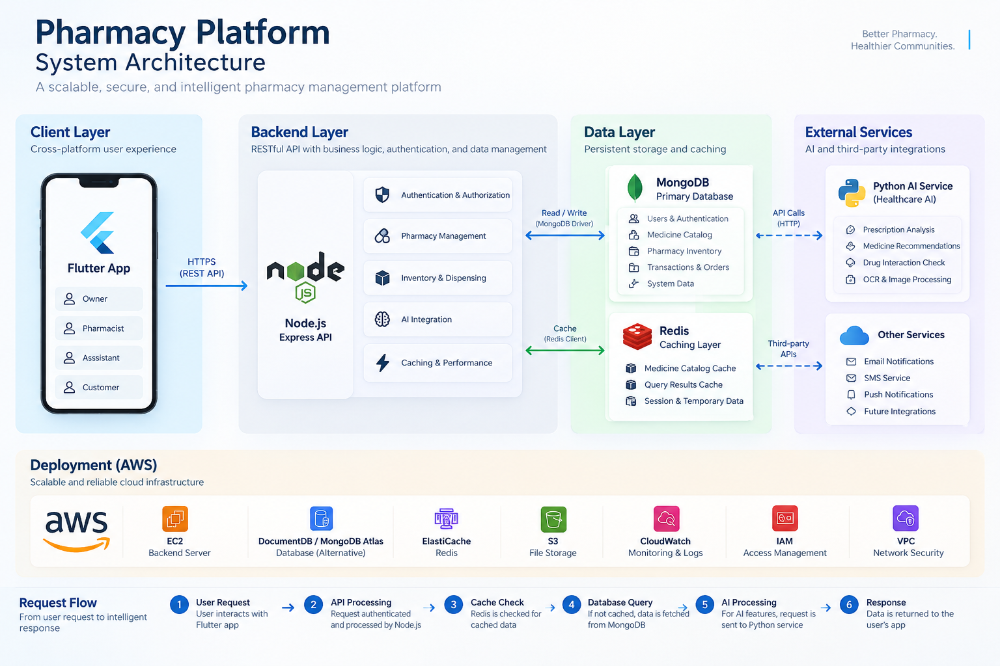

# System Architecture

## Overview

The Pharmacy Platform is a scalable pharmacy management system designed to support the daily operational needs of pharmacies.

The platform provides functionality for:

- Pharmacy user management
- Authentication and role-based authorization
- Medicine catalog management
- Pharmacy inventory management
- Medicine dispensing
- Missing medicine tracking
- Supplier order management
- Performance optimization through caching and database indexing
- Future AI-powered healthcare capabilities

The system follows a layered architecture that separates the client application, backend business logic, persistent storage, caching, and AI services.

The architecture is designed around the following principles:

- Separation of concerns
- Secure API communication
- Scalable backend services
- Efficient database access
- Read-performance optimization
- Database indexing
- Cache-aside caching
- Clear separation between master medicine data and pharmacy inventory
- Fault tolerance for non-critical infrastructure components

---

## Architecture Diagram



---

## Client Layer

The client application is built using Flutter.

The Flutter application communicates with the backend through REST APIs over HTTPS.

### Supported Roles

The platform currently supports two user roles:

- `owner`
- `employee`

### Owner

The pharmacy owner has access to administrative operations such as:

- Managing pharmacy employees
- Managing pharmacy inventory
- Managing the medicine catalog
- Creating supplier orders
- Generating orders from missing medicines
- Updating order status
- Monitoring pharmacy operations

### Employee

Employees have access to operational functionality such as:

- Viewing medicine catalog data
- Viewing pharmacy inventory
- Dispensing medicines
- Recording missing medicines
- Accessing relevant pharmacy data

Authorization is enforced by the backend and is never trusted solely from the client application.

---

## Backend Layer

The backend is implemented using:

- Node.js
- Express.js
- Mongoose
- JWT
- Joi

The backend acts as the central application layer responsible for:

1. Authentication
2. Authorization
3. Request validation
4. Business logic
5. Database access
6. Cache management
7. Error handling
8. External service integration

### Backend Request Flow

```text
Request
   │
   ▼
Route
   │
   ▼
Authentication Middleware
   │
   ▼
Role Middleware
   │
   ▼
Controller
   │
   ├── Validation
   │
   ├── Business Logic
   │
   ├── Redis
   │
   └── MongoDB
   │
   ▼
Response
````

This separation keeps authentication, authorization, validation, business logic, and persistence responsibilities clearly separated.

---

## Authentication and Authorization

Authentication is implemented using JSON Web Tokens (JWT).

After successful authentication, the backend generates a token containing the authenticated user's identity and role.

Protected endpoints require:

```http
Authorization: Bearer <JWT>
```

The backend verifies the token before allowing access to protected resources.

Authorization is implemented using Role-Based Access Control (RBAC).

### Owner Permissions

```text
Owner
 ├── Create Employee
 ├── Add Catalog Medicine
 ├── Add Inventory Medicine
 ├── Create Order
 └── Update Order Status
```

### Employee Permissions

```text
Employee
 ├── View Catalog
 ├── View Inventory
 ├── Dispense Medicine
 └── Record Missing Medicine
```

The backend remains the final authority for authorization decisions.

---

## Data Layer

MongoDB is used as the primary database.

MongoDB is the system's **Source of Truth**.

The backend uses Mongoose for:

* Schema definition
* Data validation constraints
* Relationships through references
* Population
* Database queries
* Index management

### Main Data Domains

```text
User
 │
 └── Authentication and pharmacy users


MedicineCatalog
 │
 └── Master medicine information


Medicine
 │
 └── Pharmacy-specific inventory


MissingMedicine
 │
 └── Missing medicines reported by staff


Order
 │
 └── Supplier purchase orders


DispensingTransaction
 │
 └── Medicine dispensing records
```

---

## Medicine Data Architecture

One of the main architectural decisions in the platform is separating master medicine information from pharmacy-specific inventory information.

Instead of storing all medicine information directly inside the pharmacy inventory document, the platform uses two separate entities:

```text
MedicineCatalog
       │
       │ reference
       ▼
Medicine
```

### MedicineCatalog

`MedicineCatalog` represents general medicine information.

It contains:

```text
name
barcode
activeIngredient
manufacturer
category
dosageForm
strength
```

This data represents the medicine itself rather than a specific pharmacy's stock.

### Medicine

`Medicine` represents a medicine inside a specific pharmacy's inventory.

It contains:

```text
medicineCatalog
price
stockQuantity
expiryDate
supplier
```

This separation provides several architectural advantages:

* Reduces duplication of master medicine information
* Separates general medicine data from pharmacy-specific data
* Allows multiple pharmacy inventory records to reference the same catalog medicine
* Makes medicine discovery and search more efficient
* Creates a suitable read-heavy dataset for caching
* Provides a foundation for future centralized medicine datasets

---

## Redis Caching Layer

Redis is used as a caching layer in front of MongoDB.

MongoDB remains the **Source of Truth**, while Redis is used strictly as a performance optimization layer.

The current caching strategy follows the **Cache-Aside Pattern**.

### Cache Flow

```text
Client
   │
   ▼
Backend
   │
   ▼
Redis
 ┌─┴─────────────┐
 │               │
HIT             MISS
 │               │
 ▼               ▼
Response       MongoDB
                 │
                 ▼
               Redis
                 │
                 ▼
              Response
```

The primary caching target is `MedicineCatalog` because it is expected to be:

* Frequently read
* Relatively stable
* Shared across many requests
* Suitable for repeated search operations

---

## Cache TTL

Cached `MedicineCatalog` responses currently use a TTL of:

```text
300 seconds
```

Equivalent to:

```text
5 minutes
```

After expiration, the next request retrieves fresh data from MongoDB and repopulates the cache.

---

## Cache Invalidation

When cached `MedicineCatalog` data becomes outdated, the corresponding cache entries are invalidated.

Current flow:

```text
Create Catalog Medicine
        │
        ▼
     MongoDB
        │
        ▼
Invalidate Redis Cache
        │
        ▼
Next GET Request
        │
        ▼
     MongoDB
        │
        ▼
   Populate Redis
```

This prevents stale catalog data from remaining cached after data changes.

---

## Redis Failure Strategy

Redis is intentionally treated as a **non-critical dependency**.

If Redis becomes unavailable, the backend should continue serving requests using MongoDB.

```text
Redis
  ❌
  │
  ▼
MongoDB
  ✅
  │
  ▼
Response
```

The caching layer therefore improves performance without becoming a single point of failure.

The architectural rule is:

```text
MongoDB = Source of Truth
Redis   = Performance Layer
```

---

## Database Indexing

Database indexes are used to optimize frequently executed queries.

Indexes are selected according to actual query patterns rather than being added indiscriminately.

### MedicineCatalog Indexes

```text
barcode   → Unique Index
name      → Index
category  → Index
```

These indexes support common operations such as:

```text
Search by barcode
Search by medicine name
Filter by category
```

### Medicine Indexes

```text
medicineCatalog → Index
expiryDate      → Index
```

These indexes support operations such as:

```text
Finding inventory by catalog medicine
Finding expired medicines
Finding medicines approaching expiration
```

---

## Performance Strategy

The platform uses multiple layers of performance optimization.

### Database Optimization

MongoDB indexes reduce unnecessary collection scans for frequently executed queries.

### Caching

Redis reduces repeated database reads for frequently requested `MedicineCatalog` data.

### Pagination

Large datasets are returned using pagination instead of returning the entire collection in a single response.

Example:

```http
GET /api/medicines?page=1&limit=10
```

Pagination reduces response size and database workload.

### Separation of Read-Heavy and Dynamic Data

Master catalog information is separated from dynamic pharmacy inventory data.

This allows the platform to apply different optimization strategies to each type of data.

---

## Request Lifecycle

A typical `MedicineCatalog` request follows this lifecycle:

```text
1. Flutter sends HTTP request
             │
             ▼
2. Express receives request
             │
             ▼
3. Authentication middleware
             │
             ▼
4. Role authorization
             │
             ▼
5. Controller
             │
             ▼
6. Redis cache lookup
             │
       ┌─────┴─────┐
       ▼           ▼
     HIT          MISS
       │           │
       │           ▼
       │        MongoDB
       │           │
       │           ▼
       │        Redis SET
       │           │
       └─────┬─────┘
             ▼
7. JSON response
             │
             ▼
8. Flutter
```

---

## AI Integration

The platform is designed to support a separate Python-based AI service using FastAPI.

The AI service is intentionally separated from the Node.js backend.

```text
Node.js Backend
       │
       │ HTTP API
       ▼
Python / FastAPI
       │
       ▼
AI / ML Models
```

This separation allows:

* Node.js to focus on application and business logic
* Python to focus on AI and machine learning workloads
* Independent scaling of AI workloads
* Independent model development and deployment

The AI service is part of the planned architecture and can be expanded independently.

---

## Cloud Deployment

The target production environment is AWS.

The architecture is designed to allow individual components to scale independently.

A future production deployment may include:

```text
AWS
│
├── Backend Infrastructure
├── Managed Database
├── Managed Redis
├── AI Service
├── Object Storage
├── Monitoring and Logging
├── IAM
└── Network Security
```

The current development environment uses Docker for infrastructure components such as Redis.

---

## Scalability Considerations

The architecture was designed with future scalability in mind.

Key scalability decisions include:

* Stateless REST API
* JWT-based authentication
* MongoDB for persistent storage
* Redis for distributed caching
* Database indexing
* Pagination
* Separate AI service
* Containerized infrastructure
* AWS-ready architecture

These decisions allow the platform to evolve from a local development environment into a production-grade distributed system without requiring a fundamental architectural redesign.

---

## Architectural Principles

### Separation of Concerns

Each component has a clearly defined responsibility.

### Source of Truth

MongoDB owns persistent application data.

### Cache-Aside

Redis accelerates frequently accessed data without becoming the authoritative data store.

### Fail-Safe Caching

Redis failures should not prevent access to persistent data.

### Least Privilege

Users receive permissions according to their roles.

### Validation at the Boundary

Incoming API requests are validated before reaching business logic.

### Performance by Design

Indexes, pagination, and caching are introduced according to expected query patterns.

### Independent Services

AI workloads are separated from the core Node.js backend.

---

## Technology Stack

| Layer          | Technology           |
| -------------- | -------------------- |
| Client         | Flutter              |
| Backend        | Node.js + Express.js |
| Database       | MongoDB              |
| ODM            | Mongoose             |
| Cache          | Redis                |
| Authentication | JWT                  |
| Validation     | Joi                  |
| AI Service     | Python + FastAPI     |
| Infrastructure | Docker               |
| Cloud          | AWS                  |

---

## Architecture Status

### Implemented

* Flutter → REST API architecture
* Node.js / Express backend
* JWT authentication
* Role-based authorization
* MongoDB persistence
* MedicineCatalog architecture
* Pharmacy inventory architecture
* MongoDB indexes
* Redis integration
* Cache-Aside strategy
* Cache TTL
* Cache invalidation
* Redis failure fallback
* Docker-based Redis infrastructure

### Planned

* Python / FastAPI AI service
* Production AWS deployment
* Managed Redis
* Production database infrastructure
* Advanced monitoring and observability
* Performance benchmarking
