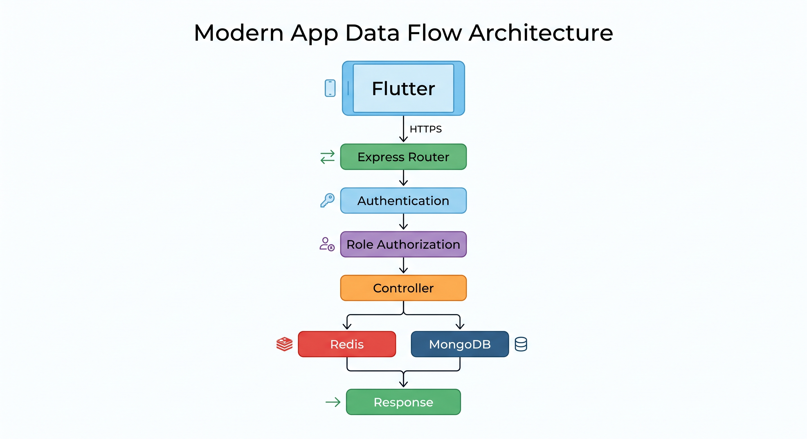

# API Documentation

## Overview

The Pharmacy Platform exposes a RESTful API built with Node.js and Express.js.

All protected endpoints require authentication using a JWT Bearer token.

The API follows a consistent structure for:

- Authentication
- Authorization
- Request validation
- Resource management
- Error handling
- JSON responses

## API Quick Reference

| Method | Endpoint | Authentication | Role | Description |
|---|---|---|---|---|
| `POST` | `/api/auth/register` | ❌ | Public | Register pharmacy owner |
| `POST` | `/api/users/login` | ❌ | Public | Authenticate user |
| `POST` | `/api/users` | ✅ | Owner | Create employee |
| `GET` | `/api/users` | ✅ | Owner | Get pharmacy users |
| `POST` | `/api/medicine-catalog` | ✅ | Owner | Add medicine to master catalog |
| `GET` | `/api/medicine-catalog` | ✅ | Owner / Employee | Search medicine catalog |
| `GET` | `/api/medicine-catalog/:id` | ✅ | Owner / Employee | Get catalog medicine |
| `POST` | `/api/medicines` | ✅ | Owner | Add medicine to pharmacy inventory |
| `GET` | `/api/medicines` | ✅ | Owner / Employee | Get inventory with filters and pagination |
| `GET` | `/api/medicines/:id` | ✅ | Owner / Employee | Get inventory medicine |
| `PATCH` | `/api/medicines/:id` | ✅ | Owner | Update inventory medicine |
| `DELETE` | `/api/medicines/:id` | ✅ | Owner | Delete inventory medicine |
| `POST` | `/api/missing-medicines` | ✅ | Owner / Employee | Record missing medicine |
| `GET` | `/api/missing-medicines` | ✅ | Owner / Employee | Get missing medicines |
| `POST` | `/api/orders` | ✅ | Owner | Create supplier order |
| `GET` | `/api/orders` | ✅ | Owner / Employee | Get orders |
| `GET` | `/api/orders/:id` | ✅ | Owner / Employee | Get order by ID |
| `POST` | `/api/orders/generate-from-missing` | ✅ | Owner | Generate order from missing medicines |
| `PATCH` | `/api/orders/:id/status` | ✅ | Owner | Update order status |
| `POST` | `/api/dispensing-transactions` | ✅ | Owner / Employee | Dispense medicine |
| `GET` | `/api/dispensing-transactions` | ✅ | Owner / Employee | Get dispensing transactions |
| `GET` | `/api/dispensing-transactions/:id` | ✅ | Owner / Employee | Get transaction by ID |

### Base URL

```text
http://localhost:3000/api
````

For production, the base URL will be replaced with the deployed AWS API endpoint.

---

## Authentication

Protected endpoints require a JWT token in the request header.

```http
Authorization: Bearer <JWT>
```

If the token is missing:

```json
{
  "message": "Authentication required"
}
```

If the token is invalid or expired:

```json
{
  "message": "Invalid or expired token"
}
```

---

## Authorization

The backend uses Role-Based Access Control (RBAC).

Supported roles:

```text
owner
employee
```

Authorization is enforced at the backend middleware level.

The client application cannot grant itself additional permissions by modifying the role sent in a request.

---

# Authentication APIs

## Register Owner

Creates a new pharmacy owner account.

### Endpoint

```http
POST /api/auth/register
```

### Authentication

Not required.

### Role

Public registration is restricted to the `owner` role.

The backend assigns the role internally rather than trusting a client-provided role.

### Request

```json
{
  "name": "Ahmed",
  "email": "ahmed@test.com",
  "password": "password123",
  "pharmacyName": "Ahmed Pharmacy",
  "phone": "01000000000"
}
```

### Response

```json
{
  "message": "Owner registered successfully",
  "user": {
    "_id": "...",
    "name": "Ahmed",
    "email": "ahmed@test.com",
    "role": "owner",
    "pharmacyName": "Ahmed Pharmacy",
    "phone": "01000000000"
  },
  "token": "<JWT>"
}
```

### Status Codes

| Status | Meaning                    |
| ------ | -------------------------- |
| `201`  | Owner created successfully |
| `400`  | Validation error           |
| `409`  | Email already exists       |
| `500`  | Server error               |

---

## Login

Authenticates an existing user.

### Endpoint

```http
POST /api/users/login
```

### Authentication

Not required.

### Request

```json
{
  "email": "ahmed@test.com",
  "password": "password123"
}
```

### Response

```json
{
  "message": "Login successful",
  "token": "<JWT>",
  "user": {
    "_id": "...",
    "name": "Ahmed",
    "email": "ahmed@test.com",
    "role": "owner",
    "pharmacyName": "Ahmed Pharmacy",
    "phone": "01000000000"
  }
}
```

### Status Codes

| Status | Meaning             |
| ------ | ------------------- |
| `200`  | Login successful    |
| `400`  | Validation error    |
| `401`  | Invalid credentials |
| `500`  | Server error        |

---

# User Management APIs

## Create Employee

Creates an employee under the authenticated pharmacy owner.

### Endpoint

```http
POST /api/users
```

### Authentication

Required.

### Role

```text
owner
```

### Request

```json
{
  "name": "Mohamed",
  "email": "mohamed@test.com",
  "password": "password123",
  "pharmacyName": "Ahmed Pharmacy",
  "phone": "01100000000"
}
```

The backend assigns:

```text
role = employee
```

The client cannot create an employee with elevated privileges by sending:

```json
{
  "role": "owner"
}
```

The backend controls the final role assignment.

### Response

```json
{
  "message": "User created successfully",
  "user": {
    "_id": "...",
    "name": "Mohamed",
    "email": "mohamed@test.com",
    "role": "employee",
    "pharmacyName": "Ahmed Pharmacy",
    "phone": "01100000000"
  }
}
```

### Status Codes

| Status | Meaning                   |
| ------ | ------------------------- |
| `201`  | Employee created          |
| `400`  | Validation error          |
| `401`  | Authentication required   |
| `403`  | Owner permission required |
| `409`  | Email already exists      |
| `500`  | Server error              |

---

## Get Users

Returns users accessible to the owner.

### Endpoint

```http
GET /api/users
```

### Authentication

Required.

### Role

```text
owner
```

### Response

```json
[
  {
    "_id": "...",
    "name": "Ahmed",
    "email": "ahmed@test.com",
    "role": "owner",
    "pharmacyName": "Ahmed Pharmacy",
    "phone": "01000000000"
  },
  {
    "_id": "...",
    "name": "Mohamed",
    "email": "mohamed@test.com",
    "role": "employee",
    "pharmacyName": "Ahmed Pharmacy",
    "phone": "01100000000"
  }
]
```

---

# Medicine Catalog APIs

The Medicine Catalog represents master medicine information.

Catalog data is separated from pharmacy-specific inventory data.

---

## Create Catalog Medicine

Adds a medicine to the master catalog.

### Endpoint

```http
POST /api/medicine-catalog
```

### Authentication

Required.

### Role

```text
owner
```

### Request

```json
{
  "name": "Panadol Extra",
  "barcode": "628100000003",
  "activeIngredient": "Paracetamol + Caffeine",
  "manufacturer": "GSK",
  "category": "Analgesic",
  "dosageForm": "Tablet",
  "strength": "500mg + 65mg"
}
```

### Response

```json
{
  "message": "Medicine added to catalog successfully",
  "medicine": {
    "_id": "...",
    "name": "Panadol Extra",
    "barcode": "628100000003",
    "activeIngredient": "Paracetamol + Caffeine",
    "manufacturer": "GSK",
    "category": "Analgesic",
    "dosageForm": "Tablet",
    "strength": "500mg + 65mg"
  }
}
```

### Status Codes

| Status | Meaning                   |
| ------ | ------------------------- |
| `201`  | Medicine added            |
| `400`  | Validation error          |
| `401`  | Authentication required   |
| `403`  | Owner permission required |
| `409`  | Barcode already exists    |
| `500`  | Server error              |

Creating a catalog medicine also invalidates existing catalog cache entries.

---

## Search Medicine Catalog

Returns catalog medicines using optional filters.

### Endpoint

```http
GET /api/medicine-catalog
```

### Authentication

Required.

### Roles

```text
owner
employee
```

### Query Parameters

| Parameter  | Description             |
| ---------- | ----------------------- |
| `name`     | Search by medicine name |
| `barcode`  | Search by exact barcode |
| `category` | Filter by category      |

### Examples

Search by name:

```http
GET /api/medicine-catalog?name=Panadol
```

Search by barcode:

```http
GET /api/medicine-catalog?barcode=628100000003
```

Filter by category:

```http
GET /api/medicine-catalog?category=Analgesic
```

### Response

```json
[
  {
    "_id": "...",
    "name": "Panadol Extra",
    "barcode": "628100000003",
    "activeIngredient": "Paracetamol + Caffeine",
    "manufacturer": "GSK",
    "category": "Analgesic",
    "dosageForm": "Tablet",
    "strength": "500mg + 65mg"
  }
]
```

### Caching

Catalog search requests use Redis with the Cache-Aside pattern.

```text
Request
   ↓
Redis
   │
   ├── HIT  → Response
   │
   └── MISS
         ↓
      MongoDB
         ↓
      Redis SET
         ↓
      Response
```

Current TTL:

```text
300 seconds
```

---

## Get Catalog Medicine by ID

Returns a specific catalog medicine.

### Endpoint

```http
GET /api/medicine-catalog/:id
```

### Authentication

Required.

### Roles

```text
owner
employee
```

### Example

```http
GET /api/medicine-catalog/6a9d69ea32ca32254bec67ce
```

### Response

```json
{
  "_id": "6a9d69ea32ca32254bec67ce",
  "name": "Panadol Extra",
  "barcode": "628100000003",
  "activeIngredient": "Paracetamol + Caffeine",
  "manufacturer": "GSK",
  "category": "Analgesic",
  "dosageForm": "Tablet",
  "strength": "500mg + 65mg"
}
```

This endpoint also uses Redis caching.

---

# Pharmacy Medicine APIs

`Medicine` represents a medicine inside the pharmacy inventory.

The catalog contains general medicine information, while the inventory record contains pharmacy-specific information.

---

## Add Medicine to Pharmacy Inventory

### Endpoint

```http
POST /api/medicines
```

### Authentication

Required.

### Role

```text
owner
```

### Request

```json
{
  "medicineCatalog": "6a9d69ea32ca32254bec67ce",
  "price": 55,
  "stockQuantity": 120,
  "expiryDate": "2027-12-31",
  "supplier": "ABC Pharma"
}
```

### Response

```json
{
  "message": "Medicine added successfully",
  "medicine": {
    "_id": "...",
    "medicineCatalog": "...",
    "price": 55,
    "stockQuantity": 120,
    "expiryDate": "2027-12-31T00:00:00.000Z",
    "supplier": "ABC Pharma"
  }
}
```

The backend verifies that the referenced `MedicineCatalog` document exists before creating the inventory record.

---

## Get Pharmacy Medicines

Returns medicines in pharmacy inventory.

### Endpoint

```http
GET /api/medicines
```

### Authentication

Required.

### Roles

```text
owner
employee
```

### Query Parameters

| Parameter  | Description                                |
| ---------- | ------------------------------------------ |
| `name`     | Search catalog medicine name               |
| `barcode`  | Search catalog barcode                     |
| `category` | Filter by catalog category                 |
| `expired`  | Filter expired or soon-to-expire medicines |
| `page`     | Page number                                |
| `limit`    | Number of records per page                 |

### Examples

```http
GET /api/medicines?name=Panadol
```

```http
GET /api/medicines?barcode=628100000003
```

```http
GET /api/medicines?category=Analgesic
```

Expired medicines:

```http
GET /api/medicines?expired=true
```

Medicines expiring within 30 days:

```http
GET /api/medicines?expired=soon
```

Pagination:

```http
GET /api/medicines?page=1&limit=10
```

### Response

```json
{
  "page": 1,
  "limit": 10,
  "total": 1,
  "pages": 1,
  "medicines": [
    {
      "_id": "...",
      "medicineCatalog": {
        "_id": "...",
        "name": "Panadol Extra",
        "barcode": "628100000003",
        "activeIngredient": "Paracetamol + Caffeine",
        "manufacturer": "GSK",
        "category": "Analgesic",
        "dosageForm": "Tablet",
        "strength": "500mg + 65mg"
      },
      "price": 55,
      "stockQuantity": 118,
      "expiryDate": "2027-12-31T00:00:00.000Z",
      "supplier": "ABC Pharma"
    }
  ]
}
```

---

## Get Medicine by ID

### Endpoint

```http
GET /api/medicines/:id
```

### Authentication

Required.

### Roles

```text
owner
employee
```

### Response

The response includes the pharmacy inventory record with the associated `MedicineCatalog` populated.

---

## Update Medicine

Updates pharmacy-specific medicine information.

### Endpoint

```http
PATCH /api/medicines/:id
```

### Authentication

Required.

### Role

```text
owner
```

### Request

```json
{
  "price": 55,
  "stockQuantity": 120
}
```

A catalog reference can also be changed:

```json
{
  "medicineCatalog": "6a9d69ea32ca32254bec67ce"
}
```

When the catalog reference changes, the backend verifies that the new catalog medicine exists.

### Response

```json
{
  "message": "Medicine updated successfully",
  "medicine": {
    "_id": "...",
    "medicineCatalog": {
      "_id": "...",
      "name": "Panadol Extra",
      "barcode": "628100000003"
    },
    "price": 55,
    "stockQuantity": 120,
    "expiryDate": "2027-12-31T00:00:00.000Z",
    "supplier": "ABC Pharma"
  }
}
```

---

## Delete Medicine

Removes a medicine from pharmacy inventory.

### Endpoint

```http
DELETE /api/medicines/:id
```

### Authentication

Required.

### Role

```text
owner
```

---

# Missing Medicine APIs

Missing Medicine records represent medicines that are unavailable or required by the pharmacy.

---

## Create Missing Medicine

### Endpoint

```http
POST /api/missing-medicines
```

### Authentication

Required.

### Roles

```text
owner
employee
```

### Request

```json
{
  "medicineName": "Panadol Extra",
  "barcode": "628100000003",
  "requiredQuantity": 20,
  "notes": "Required for upcoming demand"
}
```

### Response

```json
{
  "_id": "...",
  "medicineName": "Panadol Extra",
  "barcode": "628100000003",
  "requiredQuantity": 20,
  "status": "pending",
  "requestedBy": "...",
  "notes": "Required for upcoming demand"
}
```

---

## Get Missing Medicines

### Endpoint

```http
GET /api/missing-medicines
```

### Authentication

Required.

### Roles

```text
owner
employee
```

### Optional Filter

```http
GET /api/missing-medicines?status=pending
```

Supported statuses:

```text
pending
ordered
fulfilled
cancelled
```

---

# Order APIs

Orders represent supplier purchase orders.

They are not customer sales orders.

---

## Create Order

### Endpoint

```http
POST /api/orders
```

### Authentication

Required.

### Role

```text
owner
```

### Request

```json
{
  "supplier": "ABC Pharma",
  "items": [
    {
      "medicineName": "Panadol Extra",
      "barcode": "628100000003",
      "quantity": 40
    }
  ]
}
```

### Response

```json
{
  "message": "Order created successfully",
  "order": {
    "_id": "...",
    "supplier": "ABC Pharma",
    "status": "pending",
    "createdBy": "...",
    "generatedAutomatically": false,
    "items": [
      {
        "medicineName": "Panadol Extra",
        "barcode": "628100000003",
        "quantity": 40
      }
    ]
  }
}
```

---

## Get Orders

### Endpoint

```http
GET /api/orders
```

### Authentication

Required.

### Roles

```text
owner
employee
```

---

## Get Order by ID

### Endpoint

```http
GET /api/orders/:id
```

### Authentication

Required.

### Roles

```text
owner
employee
```

---

## Generate Order from Missing Medicines

Creates an order from all pending missing medicine records.

### Endpoint

```http
POST /api/orders/generate-from-missing
```

### Authentication

Required.

### Role

```text
owner
```

### Process

```text
Pending Missing Medicines
          ↓
Group by Barcode
          ↓
Sum Required Quantities
          ↓
Create Order
          ↓
Mark Missing Medicines as Ordered
```

Example:

```text
Panadol Extra → 20
Panadol Extra → 10
Panadol Extra → 10
```

Results in:

```text
Panadol Extra → 40
```

---

## Update Order Status

Updates the status of an order.

### Endpoint

```http
PATCH /api/orders/:id/status
```

### Authentication

Required.

### Role

```text
owner
```

### Request

```json
{
  "status": "received"
}
```

Supported statuses:

```text
pending
received
cancelled
```

When an order is marked as `received`, the backend updates the corresponding inventory quantities and fulfills the related missing medicine records.

---

# Dispensing Transaction APIs

Dispensing transactions represent medicine dispensing or sales from pharmacy inventory.

---

## Create Dispensing Transaction

### Endpoint

```http
POST /api/dispensing-transactions
```

### Authentication

Required.

### Roles

```text
owner
employee
```

### Request

```json
{
  "medicine": "6a9d7c99d5d875bcb5301b02",
  "quantity": 2
}
```

### Processing

The backend:

1. Validates the request.
2. Finds the pharmacy inventory medicine.
3. Checks stock availability.
4. Calculates the total price.
5. Creates the dispensing transaction.
6. Decreases the pharmacy stock.
7. Returns the transaction with related medicine and user information.

### Example

```text
Price = 55
Quantity = 2

Total Price = 110
```

### Response

```json
{
  "message": "Medicine dispensed successfully",
  "transaction": {
    "medicine": {
      "_id": "...",
      "medicineCatalog": {
        "name": "Panadol Extra",
        "barcode": "628100000003"
      },
      "price": 55,
      "stockQuantity": 118
    },
    "quantity": 2,
    "totalPrice": 110,
    "dispensedBy": {
      "_id": "...",
      "name": "Ahmed",
      "email": "ahmed@test.com"
    },
    "_id": "..."
  }
}
```

### Insufficient Stock

If the requested quantity exceeds the available stock:

```json
{
  "message": "Insufficient stock"
}
```

---

## Get Dispensing Transactions

### Endpoint

```http
GET /api/dispensing-transactions
```

### Authentication

Required.

### Roles

```text
owner
employee
```

The response includes the related medicine, catalog information, and dispensing user.

---

## Get Dispensing Transaction by ID

### Endpoint

```http
GET /api/dispensing-transactions/:id
```

### Authentication

Required.

### Roles

```text
owner
employee
```

---

# HTTP Status Code Strategy

The API uses standard HTTP status codes.

| Status | Usage                                              |
| ------ | -------------------------------------------------- |
| `200`  | Successful read/update operation                   |
| `201`  | Resource successfully created                      |
| `400`  | Invalid request or validation error                |
| `401`  | Missing or invalid authentication                  |
| `403`  | Insufficient permissions                           |
| `404`  | Resource not found                                 |
| `409`  | Resource conflict, such as duplicate barcode/email |
| `500`  | Unexpected server error                            |

---

# Validation Strategy

Incoming requests are validated before business logic is executed.

Joi is used for request validation.

```text
HTTP Request
     │
     ▼
Joi Validation
     │
 ┌───┴────┐
 ▼        ▼
Valid   Invalid
 │        │
 ▼        ▼
Logic   400 Response
```

This prevents invalid data from reaching the database layer.

---

# API Security Model

The backend follows several security principles.

### Authentication

Protected resources require JWT authentication.

### Authorization

Role-based middleware restricts sensitive operations.

### Password Protection

Passwords are hashed before being stored.

### Input Validation

Joi validates incoming request data.

### Security Middleware

The Express application uses:

* Helmet
* CORS
* Morgan

### Client Trust Boundary

The backend does not trust the role supplied by the client when creating users.

For example, public registration always creates an owner account, while owner-created users are assigned the employee role.

---

# API Design Principles

### RESTful Resources

Endpoints are organized around business resources:

```text
/users
/medicine-catalog
/medicines
/missing-medicines
/orders
/dispensing-transactions
```

### Consistent JSON Responses

Responses use JSON for both successful and error operations.

### Explicit Authorization

Sensitive operations explicitly define the required role.

### Validation Before Persistence

Invalid requests are rejected before database operations.

### Separation of Master and Operational Data

Medicine catalog endpoints manage master medicine information, while medicine endpoints manage pharmacy inventory.

### Performance-Aware APIs

Catalog queries use Redis caching, while inventory queries use pagination and database indexes.

---

# API Architecture Summary




The API layer provides a controlled boundary between the client application and the platform's business and data layers.

