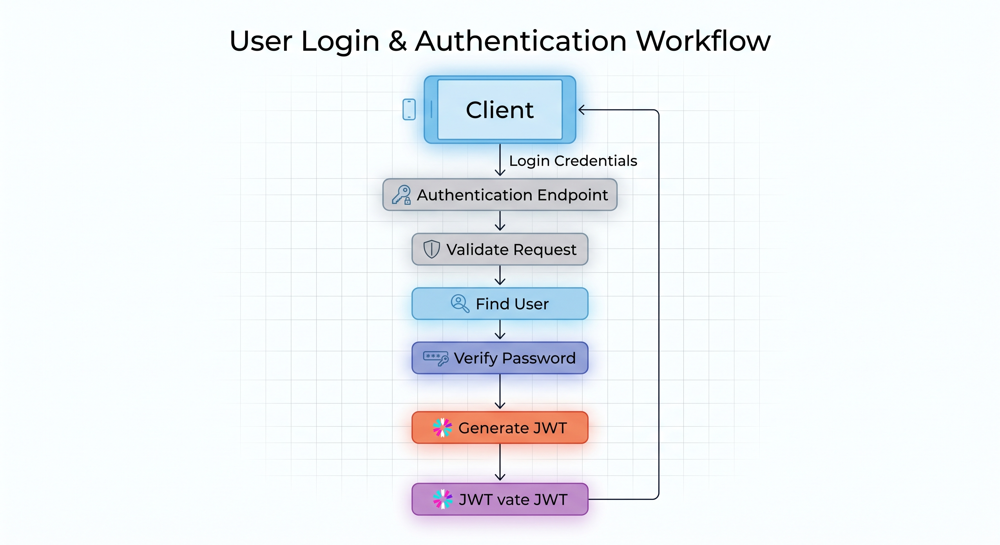
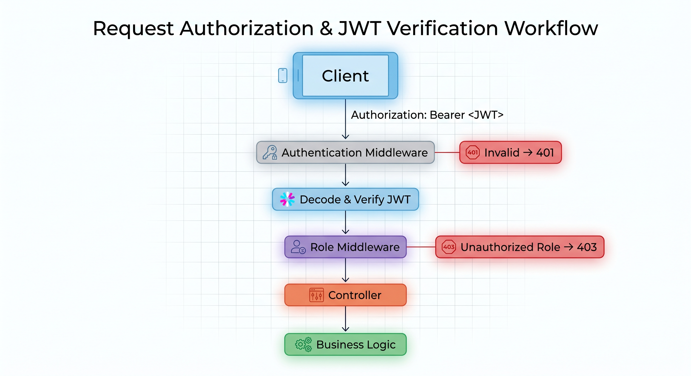
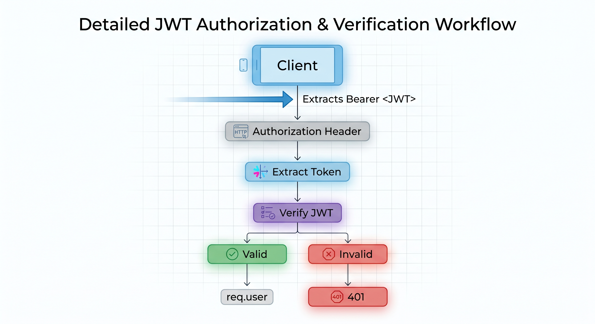
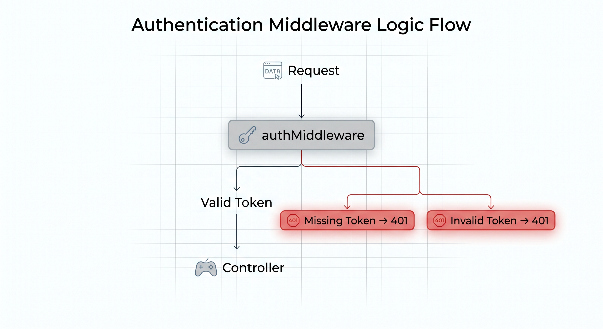
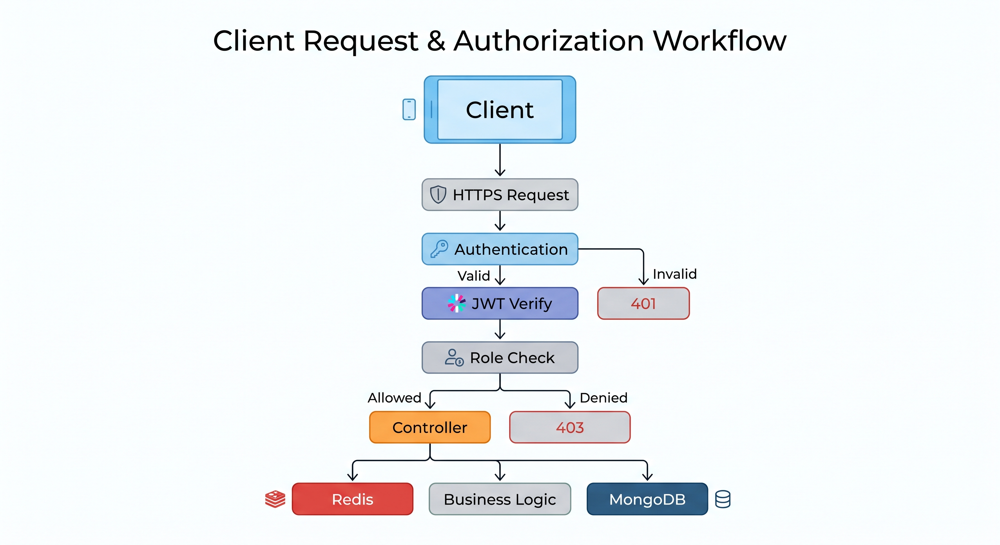

# Authentication & Authorization

## Overview

The Pharmacy Platform uses a token-based authentication and role-based authorization architecture.

The security layer is responsible for:

- User authentication
- Password protection
- JWT generation and verification
- Role-based access control
- Protected API routes
- Preventing unauthorized operations
- Enforcing permissions at the backend boundary

The backend is the final authority for authentication and authorization decisions.

---

## Security Architecture

The authentication and authorization flow follows this structure:


For protected requests:



---

## Password Security

Passwords are never stored as plain text.

Before storing a password, the backend hashes it using `bcrypt`.

```text
Plain Password
      │
      ▼
   bcrypt
      │
      ▼
Password Hash
      │
      ▼
   MongoDB
```

During authentication:

```text
Entered Password
      │
      ▼
   bcrypt
      │
      ▼
Compare with Stored Hash
      │
 ┌────┴────┐
 ▼         ▼
Match    No Match
 │         │
 ▼         ▼
JWT       401
```

The password hash is also excluded from normal user queries using:

```js
select: false
```

This reduces the risk of accidentally returning password hashes through API responses.

---

## Owner Registration

Public registration is intentionally restricted to creating pharmacy owners.

### Endpoint

```http
POST /api/auth/register
```

The client does not control the final role.

Even if a client attempts to submit:

```json
{
  "role": "employee"
}
```

the backend assigns:

```text
role = owner
```

This prevents public users from creating arbitrary privileged roles.

---

## User Login

Users authenticate using:

```http
POST /api/users/login
```

The request contains:

```json
{
  "email": "ahmed@test.com",
  "password": "password123"
}
```

The backend:

1. Validates the request.
2. Finds the user by email.
3. Retrieves the password hash.
4. Compares the provided password using bcrypt.
5. Generates a JWT if authentication succeeds.

---

## JWT Architecture

After successful authentication, the backend generates a signed JWT.

The token contains the information required to identify the authenticated user.

Conceptually:

```text
JWT
 │
 ├── userId
 └── role
```

The token is signed using a secret stored in an environment variable.

```env
JWT_SECRET=your_super_secret_key
```

The secret is never hardcoded into the application source code.

---

## JWT Request Flow

A protected request contains:

```http
Authorization: Bearer <JWT>
```

The authentication middleware:

1. Reads the `Authorization` header.
2. Extracts the Bearer token.
3. Verifies the token signature.
4. Checks token validity.
5. Stores the decoded user information in `req.user`.
6. Passes control to the next middleware.

Conceptually:


---

## Authentication Middleware

Protected routes use the authentication middleware before reaching the controller.



Example protected route:

```js
router.get(
  "/",
  authMiddleware,
  getMedicines
);
```

---

## Role-Based Access Control

The platform uses Role-Based Access Control (RBAC).

Supported roles:

```text
owner
employee
```

Permissions are assigned according to the user's role.

```text
                    ┌─────────────┐
                    │     User    │
                    └──────┬──────┘
                           │
                     JWT contains
                         role
                           │
              ┌────────────┴────────────┐
              ▼                         ▼
           Owner                     Employee
              │                         │
              ▼                         ▼
     Administrative              Operational
       Operations                 Operations
```

---

## Role Middleware

Authorization is implemented using a reusable role middleware.

Conceptually:

```js
roleMiddleware(["owner"])
```

or:

```js
roleMiddleware(["owner", "employee"])
```

The middleware checks:

```text
req.user.role
```

against the roles allowed for the endpoint.

### Authorized

```text
User Role = owner
Allowed   = owner
Result    = Continue
```

### Unauthorized

```text
User Role = employee
Allowed   = owner
Result    = 403 Forbidden
```

---

## Permission Matrix

| Resource / Operation         |  Owner | Employee |
| ---------------------------- | :----: | :------: |
| Register Owner               | Public |  Public  |
| Login                        |    ✓   |     ✓    |
| Create Employee              |    ✓   |     ✗    |
| View Users                   |    ✓   |     ✗    |
| Create Catalog Medicine      |    ✓   |     ✗    |
| View Catalog                 |    ✓   |     ✓    |
| Add Inventory Medicine       |    ✓   |     ✗    |
| View Inventory               |    ✓   |     ✓    |
| Update Inventory Medicine    |    ✓   |     ✗    |
| Delete Inventory Medicine    |    ✓   |     ✗    |
| Create Missing Medicine      |    ✓   |     ✓    |
| View Missing Medicines       |    ✓   |     ✓    |
| Create Order                 |    ✓   |     ✗    |
| View Orders                  |    ✓   |     ✓    |
| Generate Order               |    ✓   |     ✗    |
| Update Order Status          |    ✓   |     ✗    |
| Dispense Medicine            |    ✓   |     ✓    |
| View Dispensing Transactions |    ✓   |     ✓    |

---

## Privilege Escalation Protection

The backend does not trust role information supplied by the client.

For example, when an owner creates an employee, the client does not determine the final role.

The backend explicitly assigns:

```text
role = employee
```

Similarly, public registration explicitly creates:

```text
role = owner
```

This prevents a malicious client from attempting:

```json
{
  "role": "owner"
}
```

when creating an employee.

---

## Authentication vs Authorization

Authentication and authorization are intentionally separated.

### Authentication

Answers:

> Who is this user?

Implemented using:

```text
JWT
```

### Authorization

Answers:

> Is this user allowed to perform this operation?

Implemented using:

```text
RBAC
```

The complete flow is:

```text
Authentication
      │
      ▼
Identify User
      │
      ▼
Authorization
      │
      ▼
Check Role
      │
      ▼
Allow / Deny Operation
```

---

## Security Middleware Order

Protected requests follow this order:

```text
HTTP Request
     │
     ▼
Express
     │
     ▼
authMiddleware
     │
     ▼
roleMiddleware
     │
     ▼
Controller
     │
     ▼
Database / Redis
```

This ensures that authorization checks occur before sensitive business operations are executed.

---

## Input Validation

Authentication and user-management requests are validated using Joi.

Example:

```text
Request
   │
   ▼
Joi Validation
   │
 ┌─┴──────────┐
 ▼            ▼
Valid       Invalid
 │            │
 ▼            ▼
Business     400
Logic
```

Validation prevents malformed or unexpected input from reaching the business and database layers.

---

## Security Headers

The Express application uses Helmet.

```js
app.use(helmet());
```

Helmet provides a set of HTTP security headers that help reduce exposure to common web-based attacks.

---

## CORS

CORS is enabled at the Express application level.

```js
app.use(cors());
```

This allows the API to support clients that require cross-origin communication, including web-based clients.

The backend remains responsible for authentication and authorization regardless of the client platform.

---

## Environment Secrets

Sensitive configuration values are stored in environment variables.

Example:

```env
PORT=3000
MONGO_URI=mongodb://127.0.0.1:27017/pharmacy_db
JWT_SECRET=your_super_secret_key
```

The `.env` file is excluded from version control.

```text
.env
```

is included in:

```text
.gitignore
```

This prevents secrets and environment-specific configuration from being committed to the repository.

---

## Security Error Handling

The API uses different status codes for authentication and authorization failures.

### Missing Authentication

```http
401 Unauthorized
```

```json
{
  "message": "Authentication required"
}
```

### Invalid or Expired Token

```http
401 Unauthorized
```

```json
{
  "message": "Invalid or expired token"
}
```

### Insufficient Permissions

```http
403 Forbidden
```

```json
{
  "message": "Access denied"
}
```

This distinction makes the API behavior predictable for both the client and development team.

---

## Security Design Principles

### Backend as the Trust Boundary

The backend is responsible for enforcing all security-sensitive rules.

### Least Privilege

Users receive only the permissions required by their role.

### Secure Password Storage

Passwords are hashed before persistence.

### Token-Based Authentication

JWT provides stateless authentication for API requests.

### Explicit Authorization

Sensitive endpoints explicitly define their allowed roles.

### No Client-Controlled Privilege Assignment

The client cannot elevate its privileges by modifying role fields.

### Secret Isolation

Secrets are stored outside the source code.

### Validation at the Boundary

Invalid requests are rejected before business logic execution.

---

## Security Architecture Summary


