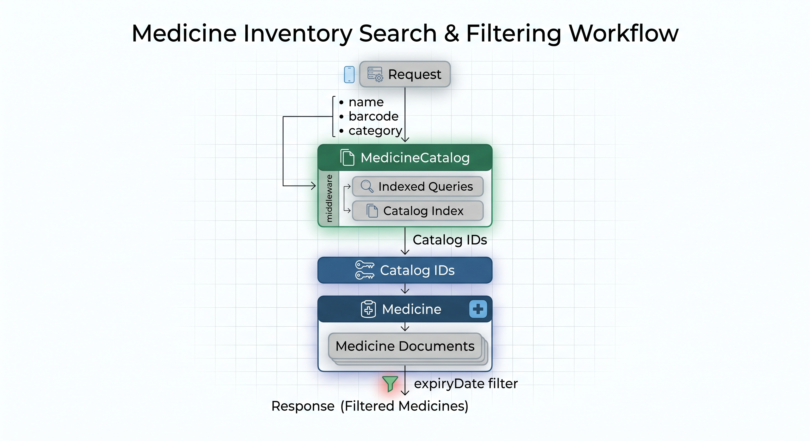
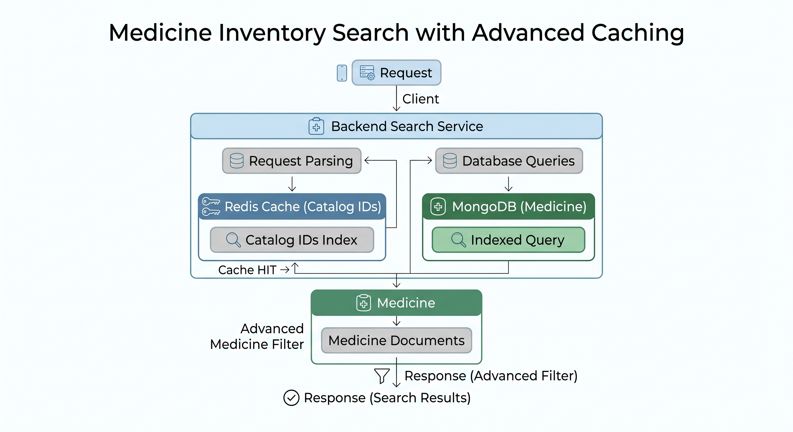
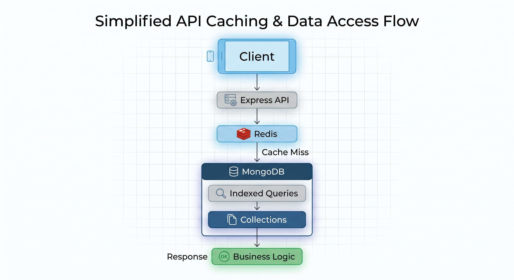
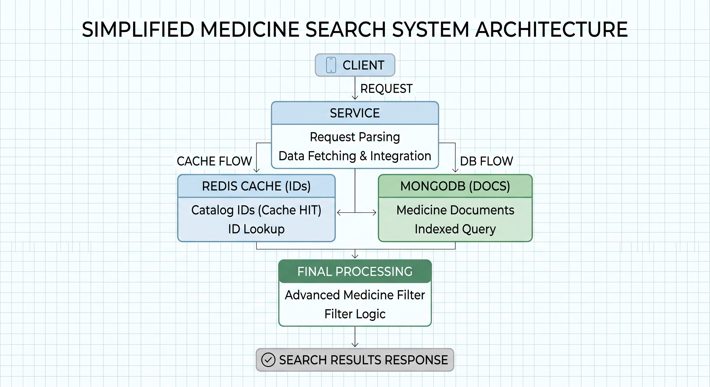

# Database Indexing Strategy

## 1. Overview

Database indexing is a core part of the pharmacy backend performance strategy.

The system uses MongoDB as its primary database, and indexes are designed around the application's most common query patterns.

The main goals of indexing are:

- Reduce query execution time.
- Improve search performance.
- Support efficient filtering.
- Improve relationship lookups.
- Maintain acceptable performance as the dataset grows.
- Avoid unnecessary full collection scans.

Indexes are especially important for the medicine catalog because it is expected to contain a large number of medicine records.

---

## 2. Indexing Philosophy

Indexes are not added to every field automatically.

Each index should have a clear purpose based on an actual query pattern.

The system follows these principles:

1. Index frequently queried fields.
2. Index fields used for filtering.
3. Index fields used for relationships.
4. Use unique indexes where uniqueness is required.
5. Avoid excessive indexes because indexes consume storage and increase write overhead.
6. Design indexes based on real application queries.

---

## 3. MedicineCatalog Indexes

The `MedicineCatalog` collection represents the master medicine dataset.

Current indexes:

```js
medicineCatalogSchema.index({ name: 1 });
medicineCatalogSchema.index({ category: 1 });
````

The `barcode` field is also configured as unique:

```js
barcode: {
  type: String,
  required: true,
  unique: true,
  trim: true
}
```

This creates a unique index for barcode values.

### Indexed Fields

| Field      | Index  | Purpose                                              |
| ---------- | ------ | ---------------------------------------------------- |
| `barcode`  | Unique | Fast exact barcode lookup and uniqueness enforcement |
| `name`     | Yes    | Medicine name searching                              |
| `category` | Yes    | Category filtering                                   |

---

## 4. Barcode Index

Barcode is one of the most important fields in the system.

The catalog defines:

```js
barcode: {
  type: String,
  required: true,
  unique: true,
  trim: true
}
```

The unique index provides two benefits:

### Performance

Barcode lookups can be performed efficiently:

```http
GET /api/medicine-catalog?barcode=628100000003
```

### Data Integrity

MongoDB prevents duplicate barcode values from being inserted.

This is important because a barcode should identify a specific catalog medicine.

---

## 5. Medicine Name Index

The catalog defines:

```js
medicineCatalogSchema.index({ name: 1 });
```

This supports queries based on medicine name.

Example:

```http
GET /api/medicine-catalog?name=Panadol
```

The backend uses a case-insensitive regular expression:

```js
filter.name = {
  $regex: name,
  $options: "i"
};
```

The index provides a useful indexing foundation for name-based queries.

However, arbitrary regex patterns, especially patterns that do not start from the beginning of the indexed field, may not fully benefit from a standard B-tree index.

For large-scale search, a dedicated search strategy may be introduced later.

---

## 6. Category Index

The catalog defines:

```js
medicineCatalogSchema.index({ category: 1 });
```

This supports category-based filtering.

Example:

```http
GET /api/medicine-catalog?category=Analgesics
```

Without an appropriate index, MongoDB may need to inspect a large portion of the collection.

The category index allows MongoDB to locate matching records more efficiently.

---

## 7. Medicine Inventory Indexes

The `Medicine` collection represents pharmacy-specific inventory.

Current indexes:

```js
medicineSchema.index({ medicineCatalog: 1 });
medicineSchema.index({ expiryDate: 1 });
```

### Indexed Fields

| Field             | Index | Purpose                                    |
| ----------------- | ----- | ------------------------------------------ |
| `medicineCatalog` | Yes   | Relationship between inventory and catalog |
| `expiryDate`      | Yes   | Expiry and soon-to-expire filtering        |

---

## 8. MedicineCatalog Relationship Index

Each pharmacy medicine contains:

```js
medicineCatalog: {
  type: mongoose.Schema.Types.ObjectId,
  ref: "MedicineCatalog",
  required: true
}
```

The index:

```js
medicineSchema.index({ medicineCatalog: 1 });
```

supports queries that retrieve pharmacy inventory associated with catalog medicines.

This is particularly important because the inventory API first searches the catalog and then uses the resulting catalog IDs to retrieve inventory records.

The query pattern is conceptually:

```text
MedicineCatalog
      ↓
Find matching catalog IDs
      ↓
Medicine.medicineCatalog
      ↓
Return pharmacy inventory
```

The index helps the second stage of this process.

---

## 9. Expiry Date Index

The inventory collection defines:

```js
medicineSchema.index({ expiryDate: 1 });
```

This supports expiry-related queries.

For example:

```http
GET /api/medicines?expired=true
```

The backend uses:

```js
filter.expiryDate = {
  $lt: new Date()
};
```

For medicines that will expire soon:

```js
filter.expiryDate = {
  $gte: today,
  $lte: thirtyDaysLater
};
```

The expiry index is therefore useful for inventory monitoring and pharmacy alerts.

---

## 10. Indexing and Pagination

The inventory API supports pagination:

```http
GET /api/medicines?page=1&limit=10
```

The backend uses:

```js
const skip = (Number(page) - 1) * Number(limit);

const medicines = await Medicine.find(filter)
  .populate("medicineCatalog")
  .skip(skip)
  .limit(Number(limit));
```

Indexes help MongoDB locate matching documents before pagination is applied.

However, traditional `skip()` pagination can become less efficient for very large offsets.

For a large-scale deployment, cursor-based pagination can be considered.

---

## 11. Indexing and Search Filters

The medicine inventory API supports:

* Medicine name
* Barcode
* Category
* Expired medicines
* Soon-to-expire medicines

Name, barcode, and category belong to `MedicineCatalog`, while expiry information belongs to `Medicine`.

Therefore, the backend performs the search in two stages:


This design keeps master medicine information separate from pharmacy-specific inventory.

---

## 12. Indexing and Data Integrity

Indexes are not only performance tools.

Unique indexes can also enforce data integrity.

For example:

```js
unique: true
```

on the catalog barcode ensures that duplicate barcode values cannot be stored.

This protects the database even if an application-level validation check is accidentally bypassed.

The database therefore acts as an additional integrity boundary.

---

## 13. Indexes and Write Performance

Indexes improve reads but introduce a small write cost.

Whenever a document is inserted, updated, or deleted, MongoDB may also need to update the relevant indexes.

For this reason, the project intentionally avoids indexing every field.

The current strategy focuses on fields that are frequently involved in:

* Searching.
* Filtering.
* Relationships.
* Uniqueness constraints.

This provides a balance between read performance and write performance.

---

## 14. Indexes and Redis Caching

Database indexes and Redis caching solve different performance problems.

### MongoDB Index

```text
API
 ↓
MongoDB
 ↓
Index
 ↓
Matching documents
```

Indexes make database queries more efficient.

### Redis Cache

```text
API
 ↓
Redis
 ↓
Cached response
```

Caching can avoid the database query completely when cached data is available.

The project uses both strategies:



This provides multiple layers of performance optimization.

---

## 15. Current Index Configuration

### MedicineCatalog

```js
medicineCatalogSchema.index({ name: 1 });
medicineCatalogSchema.index({ category: 1 });
```

And:

```js
barcode: {
  type: String,
  required: true,
  unique: true
}
```

### Medicine

```js
medicineSchema.index({ medicineCatalog: 1 });
medicineSchema.index({ expiryDate: 1 });
```

---

## 16. Future Index Improvements

As the application grows, indexes should be reviewed using real query performance data.

Potential future improvements include:

### Compound Indexes

If multiple fields are frequently queried together, compound indexes may become beneficial.

Example:

```js
medicineSchema.index({
  medicineCatalog: 1,
  expiryDate: 1
});
```

This should only be introduced after confirming that the query pattern justifies it.

### Search Optimization

The current name search uses regular expressions.

For a very large catalog, a dedicated search solution may provide better performance for:

* Partial name matching.
* Arabic medicine names.
* English medicine names.
* Typo-tolerant search.
* Prefix search.

### Query Analysis

MongoDB's query execution statistics can be used to identify inefficient queries.

For example:

```js
db.medicinecatalogs
  .find({ category: "Analgesics" })
  .explain("executionStats");
```

This can help determine whether MongoDB is using the expected index.

---

## 17. Index Monitoring Strategy

Indexes should not be considered a one-time configuration.

As the system evolves, the team should periodically evaluate:

* Query execution time.
* Collection size.
* Index usage.
* Memory consumption.
* Read/write ratio.
* Slow queries.
* Unused indexes.

The goal is to keep the indexing strategy aligned with actual application behavior.

---

## 18. Production Considerations

The current indexes are suitable for the MVP architecture.

Before production deployment at significant scale, the indexing strategy should be validated using realistic data volumes.

Important considerations include:

* Running `explain("executionStats")` on critical queries.
* Monitoring slow queries.
* Checking index usage.
* Evaluating compound indexes.
* Reviewing pagination performance.
* Avoiding redundant indexes.
* Reassessing indexes as API query patterns evolve.

Indexes should be based on measured workload rather than assumptions.

---

## 19. Indexing Design Principles

The pharmacy backend follows these principles:

### Query-Driven

Indexes are created based on actual API query patterns.

### Minimal

Only useful indexes are maintained.

### Integrity-Aware

Unique indexes are used when database-level uniqueness is required.

### Performance-Oriented

Frequently queried fields receive appropriate indexes.

### Evolvable

Indexes can be expanded or redesigned as the dataset and workload grow.

### Measurable

Production optimization should be supported by query execution statistics rather than assumptions.

---

## 20. Database Performance Architecture

The final performance model is:


Redis reduces repeated database reads for cacheable data.

MongoDB indexes improve the efficiency of queries that still reach the database.

Together, they provide a layered approach to backend performance.

---

## 21. Summary

The database indexing strategy is designed around the actual pharmacy workflows.

The most important indexes are:


```text
MedicineCatalog
├── barcode (unique)
├── name
└── category

Medicine
├── medicineCatalog
└── expiryDate
```

These indexes support the system's primary operations:

* Medicine search.
* Barcode lookup.
* Category filtering.
* Inventory-to-catalog relationships.
* Expiry monitoring.
* Efficient retrieval of pharmacy inventory.

The strategy intentionally avoids excessive indexing while providing a foundation that can scale with the medicine catalog and pharmacy inventory.

Future optimization will be driven by real query execution statistics and production workload measurements.

