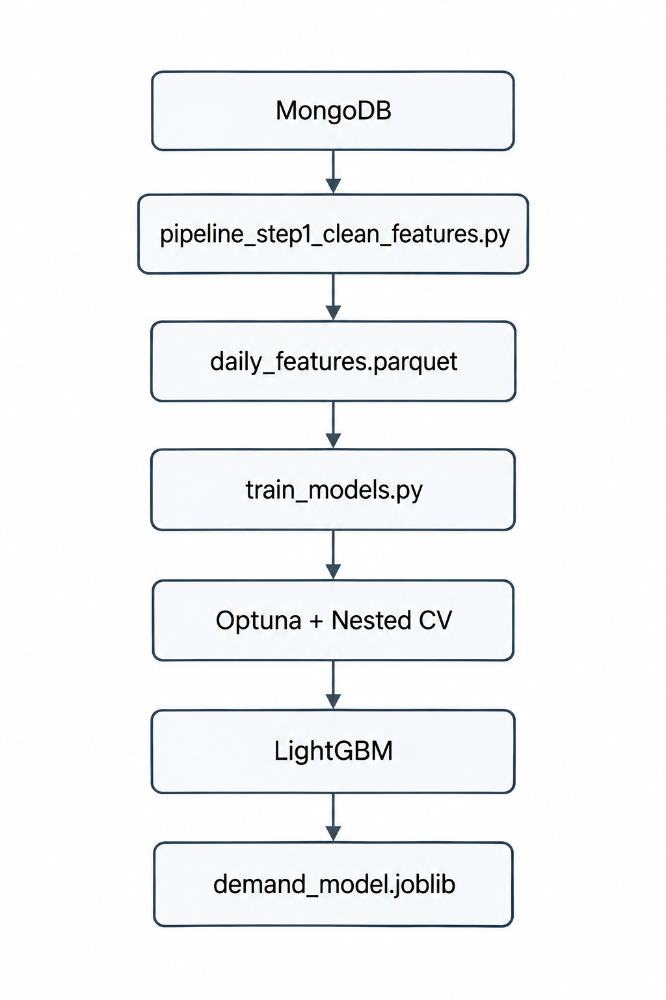
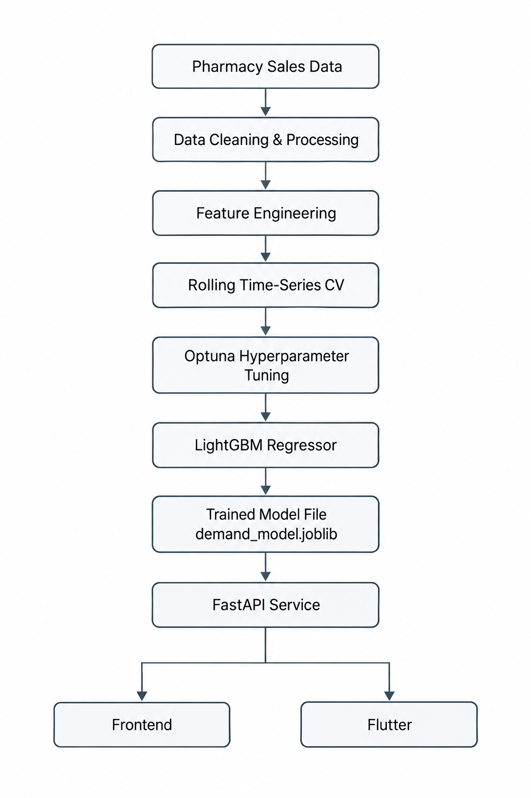
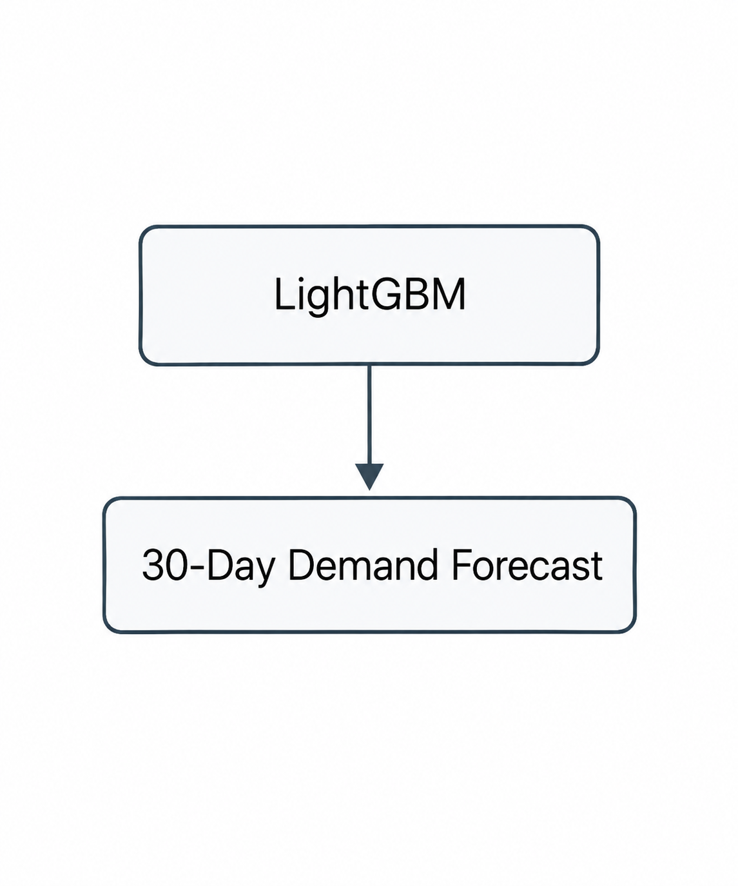
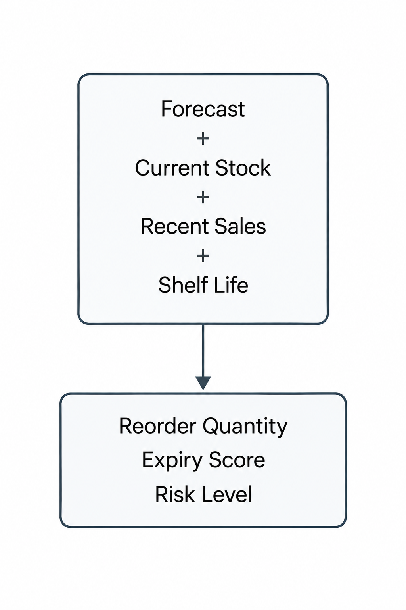

# Pharmacy AI Model Documentation

## 1. Overview

### 1.1 Model Name

**Pharmacy Demand Forecasting & Inventory Risk AI**

### 1.2 Purpose

The Pharmacy AI service is designed to support pharmacy inventory management by:

* Forecasting product demand for the next 30 days.
* Estimating the quantity that should be reordered.
* Estimating inventory expiry risk.
* Providing actionable inventory recommendations.

The system is designed to transform historical pharmacy sales data into demand predictions and inventory-management insights. The overall product workflow is based on collecting sales, stock, and expiry information, analyzing sales patterns, predicting demand and risk, and then supporting pharmacist actions. 

### 1.3 Model Type

The main AI model is a:

**Regression model**

using:

**LightGBM — LGBMRegressor**

The model predicts:

```text
sales_next_30_days
```

which represents the total expected units sold for a product during the following 30 days.

A single **global LightGBM model** is trained across all products instead of training a separate model for every product. 

### 1.4 Main Use Cases

| Use Case                  | Description                                                                  |
| ------------------------- | ---------------------------------------------------------------------------- |
| Demand Forecasting        | Predict expected sales for the next 30 days                                  |
| Inventory Reordering      | Calculate recommended reorder quantity                                       |
| Expiry Risk               | Estimate whether current stock may become problematic relative to shelf life |
| Stock Monitoring          | Combine current stock with predicted demand                                  |
| Pharmacy Decision Support | Help pharmacists make purchasing and inventory decisions                     |

---

# 2. Data

## 2.1 Data Source

The original training dataset is stored in:

```text
Pharmacy_data.xlsx
```

The dataset contains four main tables:

```text
FactSales
DimDate
DimPharmacy
DimProduct
```

The original dataset contains:

| Table       |   Rows |
| ----------- | -----: |
| FactSales   | 62,139 |
| DimDate     |    731 |
| DimPharmacy |    120 |
| DimProduct  |    220 |

The sales data contains transactions from **120 pharmacies** and covers **731 calendar days**.

The preprocessing pipeline aggregates sales across pharmacies to create one national daily demand series per product. 

---

## 2.2 Raw Sales Features

The original `FactSales` table contains:

| Feature      | Description                                |
| ------------ | ------------------------------------------ |
| `SalesID`    | Unique sales transaction identifier        |
| `DateKey`    | Reference to the date dimension            |
| `PharmacyID` | Pharmacy identifier                        |
| `ProductID`  | Product identifier                         |
| `UnitsSold`  | Number of units sold                       |
| `RevenueEUR` | Sales revenue                              |
| `CostEUR`    | Product cost                               |
| `MarginEUR`  | Sales margin                               |
| `PromoFlag`  | Indicates whether the product was promoted |

The model does **not** directly use all of these raw fields.

---

## 2.3 Model Features

The final LightGBM model uses the following features:

| Feature               | Type        | Description                                        |
| --------------------- | ----------- | -------------------------------------------------- |
| `day_of_week`         | Numeric     | Day of the week                                    |
| `month`               | Numeric     | Month number                                       |
| `is_holiday`          | Binary      | Indicates whether the date is considered a holiday |
| `sales_last_7_days`   | Numeric     | Total units sold during the previous 7 days        |
| `sales_last_30_days`  | Numeric     | Total units sold during the previous 30 days       |
| `rolling_avg_14_days` | Numeric     | Average sales over the previous 14 days            |
| `PromoActive`         | Binary      | Indicates whether a promotion was active           |
| `ProductID`           | Categorical | Product identifier                                 |
| `Category`            | Categorical | Product category                                   |

`ProductID` and `Category` are passed to LightGBM as categorical features. 

---

## 2.4 Target

The model target is:

```text
sales_next_30_days
```

It is calculated as:

```text
sales_next_30_days(t)
=
UnitsSold(t+1) + ... + UnitsSold(t+30)
```

In other words, for every product and date, the model learns to predict the total demand during the next 30 days. 

---

## 2.5 Data Cleaning

The preprocessing pipeline performs the following operations:

### Step 1 — Remove duplicate sales

Duplicate `SalesID` records are removed.

### Step 2 — Convert date fields

Date-related columns are converted to proper datetime types.

### Step 3 — Remove discontinued products from active forecasting

Products marked as discontinued are removed from the active forecasting scope.

### Step 4 — Merge data

Sales are merged with:

```text
DimDate
DimProduct
```

to obtain actual dates and product information.

### Step 5 — Aggregate sales

Sales are aggregated by:

```text
ProductID
ProductName
Category
Date
```

and sales from all pharmacies are summed together.

### Step 6 — Fill missing dates

A complete calendar is created.

If a product has no recorded sale on a particular day, that day is represented as:

```text
UnitsSold = 0
```

This allows the model to distinguish between zero demand and missing dates.

### Step 7 — Create promotion feature

`PromoActive` indicates whether a product was under promotion on a particular day.

### Step 8 — Create temporal features

The pipeline generates:

```text
day_of_week
month
is_holiday
```

### Step 9 — Create rolling sales features

The pipeline calculates:

```text
sales_last_7_days
sales_last_30_days
rolling_avg_14_days
```

using previous observations only, preventing future sales from leaking into the features. 

---

# 3. Architecture

## 3.1 High-Level Architecture

<p align="center">
    
</p>

The training pipeline is separated from inference. Training happens offline, while the API only loads the already-trained model and performs prediction. 

---

## 3.2 Algorithm

The model uses:

```text
LightGBM LGBMRegressor
```

LightGBM was selected because the project requires a scalable model that can learn across many products using shared patterns.

Instead of:

```text
Product 1 → Model 1
Product 2 → Model 2
Product 3 → Model 3
...
```

the system uses:

```text
All Products
     ↓
One Global LightGBM Model
```

`ProductID` and `Category` allow the global model to distinguish between products and product categories.

---

## 3.3 Hyperparameters

The model uses Optuna with the **TPE sampler** for hyperparameter optimization.

| Hyperparameter      |            Value |
| ------------------- | ---------------: |
| `n_estimators`      |          **359** |
| `num_leaves`        |           **48** |
| `max_depth`         |            **3** |
| `learning_rate`     | **0.0793476491** |
| `min_child_samples` |           **15** |
| `subsample`         | **0.6042433891** |
| `colsample_bytree`  | **0.6742545705** |
| `random_state`      |           **42** |
| Objective           |     `regression` |

The search was performed over **25 Optuna trials** using a TPE sampler. 

---

## 3.4 Hyperparameter Search Space

The search ranges were:

| Parameter           | Search Range |
| ------------------- | ------------ |
| `n_estimators`      | 100–600      |
| `num_leaves`        | 15–127       |
| `max_depth`         | 3–10         |
| `learning_rate`     | 0.01–0.2     |
| `min_child_samples` | 5–50         |
| `subsample`         | 0.6–1.0      |
| `colsample_bytree`  | 0.6–1.0      |

---

## 3.5 Why These Choices?

### LightGBM

Chosen as the main regression algorithm because the project requires:

* A scalable global model.
* Support for many products.
* Efficient inference.
* Native categorical feature handling.

### Optuna

Used because LightGBM can be sensitive to hyperparameter choices.

Optuna searches for a parameter configuration that minimizes validation MAE.

### Global Model

A single global model avoids repeatedly training separate models for individual products and makes the architecture more scalable.

---

# 4. Training

## 4.1 Training Pipeline

Training is performed only by:

```text
train_models.py
```

The production API does **not** train the model.

The workflow is:

<p align="center">
    
</p>

The saved model is then loaded by the API at startup. 

---

## 4.2 Cross-Validation Strategy

A normal random train/test split is **not** used.

Instead, the project uses:

**Rolling-Origin Time-Series Cross-Validation**

with:

```text
5 outer folds
30-day test window
minimum 180 days of training history
```

Each outer fold represents a different point in time.

This is important for time-series forecasting because future data must not be used to predict the past.

---

## 4.3 Nested Cross-Validation

The training process uses two levels:
<p align="center">
    
</p>

The outer test windows are not used during hyperparameter tuning.

This provides a more honest estimate of generalization performance. 

---

## 4.4 Loss / Optimization

The model is a regression model:

```python
LGBMRegressor(
    objective="regression"
)
```

The main evaluation metric used during tuning is:

```text
Mean Absolute Error (MAE)
```

There are no neural-network epochs or backpropagation iterations.

Instead, LightGBM builds a sequence of boosted decision trees controlled by:

```text
n_estimators = 359
```

---

## 4.5 Overfitting Prevention

The project reduces overfitting risk through:

1. Time-aware cross-validation.
2. Nested CV.
3. Hyperparameter tuning only on training portions.
4. Separate outer test windows.
5. Limiting tree depth.
6. Controlling the number of leaves.
7. Using `min_child_samples`.
8. Using row and feature subsampling.

The model is finally retrained on all available labeled historical data using the selected hyperparameters.

---

# 5. Evaluation

## 5.1 Evaluation Metrics

The project uses different metrics depending on the task.

### Demand Forecasting

The forecasting problem is evaluated using:

```text
MAE
MAPE
```

### Risk-Level Evaluation

The derived risk level is evaluated separately using:

```text
Precision
Recall
F1-score
Specificity
Confusion Matrix
ROC AUC
```

The evaluation script explicitly separates regression evaluation from risk-level classification evaluation. 

---

## 5.2 Final Demand Forecasting Result

The final nested-CV evaluation produced:

| Metric              |               Result |
| ------------------- | -------------------: |
| Outer folds         |                **5** |
| Test window         | **30 days per fold** |
| Mean Outer-Fold MAE |      **23.58 units** |

Individual outer-fold results:

| Fold     |       MAE |
| -------- | --------: |
| Fold 1   |     21.61 |
| Fold 2   |     23.07 |
| Fold 3   |     22.22 |
| Fold 4   |     23.76 |
| Fold 5   |     27.22 |
| **Mean** | **23.58** |

The training process reports a best inner-CV MAE of approximately:

```text
30.52 units
```

while the final honest outer-fold evaluation averages approximately:

```text
23.58 units
```

---

## 5.3 Baseline Comparison

The project contains a separate baseline comparison between:

```text
Naive Baseline
vs
LightGBM
```

The naive baseline predicts the next 30-day demand using the product's trailing 30-day sales.

The comparison is performed over multiple rolling 30-day folds rather than one split. 

**The exact baseline result is not included in the verified training result available here, so it should be added from the output of `model_comparison.py` rather than estimated.**

---

## 5.4 Risk-Level Calculation

`risk_level` is **not produced by a separate trained classification model**.

Instead, the API calculates:

```text
expected_sell_days
        ↓
expiry_score
        ↓
risk_level
```

The API uses:

```text
Low    → expiry_score < 40
Medium → 40 ≤ expiry_score < 70
High   → expiry_score ≥ 70
```

The score is based on the relationship between expected selling time and estimated shelf life.

Therefore:

> The demand prediction is ML-based, while the final `risk_level` is rule-based.

This distinction should remain explicit in the documentation.

---

## 5.5 Important Limitations

### 1. Current Stock Must Be Real

The API requires:

```text
current_stock
```

This value must come from the pharmacy's actual inventory.

If the frontend sends an incorrect stock quantity, the resulting:

```text
reorder_quantity
expiry_score
risk_level
```

can also be incorrect.

The project documentation explicitly identifies real-time stock as an open production requirement. 

### 2. Training Data Is Aggregated Nationally

The current model aggregates sales across all pharmacies.

Therefore, it does not currently learn a separate demand pattern for each individual pharmacy.

### 3. Limited Historical Data

The training dataset covers 731 calendar days.

More historical sales data can improve the ability to learn long-term seasonal patterns.

### 4. Holiday Calendar

The current preprocessing pipeline contains a placeholder holiday calendar.

The project notes that the holiday calendar should eventually be replaced with a real country-specific calendar. 

### 5. Shelf Life

The original dataset does not contain actual expiry information.

Shelf life is currently simulated according to product category:

| Category        | Shelf Life |
| --------------- | ---------: |
| OTC             |   730 days |
| Personal Care   |  1095 days |
| Prescription    |   540 days |
| Wellness        |   730 days |
| Medical Devices |  1825 days |

Therefore, expiry-risk results should be considered an operational heuristic until actual batch-level expiry dates are integrated.

---

# 6. Usage

## 6.1 Requirements

Install the Python dependencies:

```bash
pip install -r requirements.txt
```

The environment includes the libraries required for:

* Data processing
* LightGBM
* Scikit-learn
* Optuna
* Model serialization
* FastAPI
* MongoDB connectivity

---

## 6.2 Training

Run preprocessing first:

```bash
python pipeline_step1_clean_features.py
```

Then train:

```bash
python train_models.py
```

This generates:

```text
demand_model.joblib
model_metadata.json
```

The project separates training from inference so that the API does not retrain the model for every request. 

---

## 6.3 Loading the Model

A simplified example:

```python
import joblib

model = joblib.load("demand_model.joblib")

prediction = model.predict(features)
```

The production API loads the model once when the service starts.

---

# 7. API

## 7.1 Base URL

```text
https://pharmteck-ai.up.railway.app
```

Swagger documentation:

```text
https://pharmteck-ai.up.railway.app/docs
```

---

## 7.2 Health Check

### GET `/`

Example response:

```json
{
  "status": "AI Service is running",
  "model": "LightGBM (global, trained once offline by train_models.py)",
  "mean_outer_fold_mae": 23.575445263082667,
  "n_outer_folds": 5
}
```

---

# 7.3 Demand Prediction

### POST `/predict`

The endpoint accepts:

```json
{
  "product_id": "PR0014",
  "current_stock": 50,
  "category": "OTC",
  "promo_planned": false
}
```

### Request Fields

| Field           | Type    | Required | Description                                      |
| --------------- | ------- | -------- | ------------------------------------------------ |
| `product_id`    | string  | Yes      | Product ID used by the trained model             |
| `current_stock` | float   | Yes      | Current real inventory quantity                  |
| `category`      | string  | No       | Product category. Default: `OTC`                 |
| `promo_planned` | boolean | No       | Whether a promotion is planned. Default: `false` |

These fields and their defaults are defined directly in `PredictRequest`. 

---

## 7.4 Response

Example:

```json
{
  "product_id": "PR0014",
  "predicted_units_next_30_days": 42.5,
  "reorder_quantity": 35.2,
  "expiry_score": 12.4,
  "risk_level": "Low"
}
```

### Response Fields

| Field                          | Type   | Description                             |
| ------------------------------ | ------ | --------------------------------------- |
| `product_id`                   | string | Requested product                       |
| `predicted_units_next_30_days` | float  | Predicted demand for the next 30 days   |
| `reorder_quantity`             | float  | Calculated recommended reorder quantity |
| `expiry_score`                 | float  | Expiry-risk score from 0 to 100         |
| `risk_level`                   | string | `Low`, `Medium`, or `High`              |

The response structure is defined by `PredictResponse` in the API service. 

---

## 7.5 Prediction Logic

The API performs the following:

<p align="center">
    
</p>

For a known product, the API takes its latest historical feature row and updates `PromoActive` according to `promo_planned` before calling the model's `predict()` method. 

---

## 7.6 Example Request

### cURL

```bash
curl -X POST "https://pharmteck-ai.up.railway.app/predict" \
  -H "Content-Type: application/json" \
  -d '{
    "product_id": "PR0014",
    "current_stock": 50,
    "category": "OTC",
    "promo_planned": false
  }'
```

---

## 7.7 Flutter Example

```dart
final response = await http.post(
  Uri.parse(
    'https://pharmteck-ai.up.railway.app/predict',
  ),
  headers: {
    'Content-Type': 'application/json',
  },
  body: jsonEncode({
    'product_id': 'PR0014',
    'current_stock': 50,
    'category': 'OTC',
    'promo_planned': false,
  }),
);
```

---

# 8. Maintenance & Updating

## 8.1 When to Retrain

The model should be retrained when:

* New sales data becomes available.
* New products are added.
* Historical data is significantly updated.
* Model performance decreases.
* Pharmacy-specific data becomes available.

The current project explicitly recommends rerunning the training process whenever `daily_features.parquet` changes. 

---

## 8.2 Retraining Pipeline

The current retraining process is:
<p align="center">
    
</p>

---

## 8.3 Model Versioning

Each production model should have an explicit version.

Recommended format:

```text
pharmacy-ai-v1.0.0
pharmacy-ai-v1.1.0
pharmacy-ai-v2.0.0
```

Recommended metadata:

```json
{
  "model_version": "v1.0.0",
  "model_type": "LightGBM",
  "target": "sales_next_30_days",
  "training_date": "YYYY-MM-DD",
  "feature_version": "v1",
  "mean_outer_fold_mae": 23.58,
  "n_outer_folds": 5
}
```

**ملاحظة:** `model_version` بهذا الشكل **اقتراح توثيقي**؛ الملف الحالي `model_metadata.json` يحتوي على الـ features والـ hyperparameters والـ evaluation results، لكنه لا يحتوي حاليًا على رقم version رسمي. 

---

# 9. Current Production Architecture
<p align="center">
    
</p>

## 10. Important Production Note

The current AI system should be understood as **two connected components**:

### Machine Learning Component

<p align="center">
    
</p>

### Business Logic Component

<p align="center">
    
</p>
This distinction is important because not every output returned by the API is directly produced by the trained ML model.

